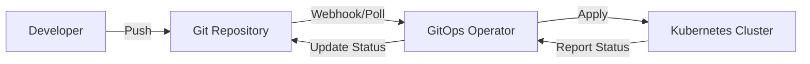

# GitOps and Configuration Management

## Overview

GitOps is a paradigm for managing infrastructure and applications where Git serves as the single source of truth. This lesson covers GitOps principles, tools, and configuration management best practices.

## GitOps Principles

### Core Concepts

1. **Declarative Configuration**: Entire system described declaratively
2. **Versioned and Immutable**: Configuration stored in Git
3. **Pulled Automatically**: Changes pulled and applied automatically
4. **Continuously Reconciled**: Actual state continuously reconciled with desired state

### GitOps Workflow



## ArgoCD

### Installation

```yaml
# argocd-install.yaml
apiVersion: v1
kind: Namespace
metadata:
  name: argocd
---
apiVersion: v1
kind: Secret
metadata:
  name: argocd-secret
  namespace: argocd
type: Opaque
```

```bash
# Install ArgoCD
kubectl create namespace argocd
kubectl apply -n argocd -f https://raw.githubusercontent.com/argoproj/argo-cd/stable/manifests/install.yaml

# Access ArgoCD UI
kubectl port-forward svc/argocd-server -n argocd 8080:443

# Get admin password
kubectl -n argocd get secret argocd-initial-admin-secret -o jsonpath="{.data.password}" | base64 -d
```

### Application Manifest

```yaml
# application.yaml
apiVersion: argoproj.io/v1alpha1
kind: Application
metadata:
  name: myapp
  namespace: argocd
  # Finalizer that ensures app is deleted when application is deleted
  finalizers:
    - resources-finalizer.argocd.argoproj.io
spec:
  project: default
  
  source:
    repoURL: https://github.com/myorg/myapp
    targetRevision: HEAD
    path: kubernetes/overlays/production
    
    # For Helm charts
    helm:
      valueFiles:
        - values-production.yaml
      parameters:
        - name: image.tag
          value: v1.2.3
  
  destination:
    server: https://kubernetes.default.svc
    namespace: production
  
  syncPolicy:
    automated:
      prune: true      # Delete resources not in Git
      selfHeal: true   # Reconcile drift
      allowEmpty: false
    
    syncOptions:
      - CreateNamespace=true
      - PrunePropagationPolicy=foreground
      - PruneLast=true
    
    retry:
      limit: 5
      backoff:
        duration: 5s
        factor: 2
        maxDuration: 3m
  
  # Ignore differences in certain fields
  ignoreDifferences:
    - group: apps
      kind: Deployment
      jsonPointers:
        - /spec/replicas
```

### Multi-Environment Setup

```yaml
# app-of-apps.yaml
apiVersion: argoproj.io/v1alpha1
kind: Application
metadata:
  name: app-of-apps
  namespace: argocd
spec:
  project: default
  source:
    repoURL: https://github.com/myorg/gitops-apps
    targetRevision: HEAD
    path: environments
  destination:
    server: https://kubernetes.default.svc
    namespace: argocd
  syncPolicy:
    automated:
      prune: true
      selfHeal: true

# environments/development.yaml
apiVersion: argoproj.io/v1alpha1
kind: Application
metadata:
  name: myapp-dev
  namespace: argocd
spec:
  project: default
  source:
    repoURL: https://github.com/myorg/myapp
    targetRevision: develop
    path: kubernetes/overlays/development
  destination:
    server: https://kubernetes.default.svc
    namespace: development
  syncPolicy:
    automated:
      prune: true
      selfHeal: true

# environments/production.yaml
apiVersion: argoproj.io/v1alpha1
kind: Application
metadata:
  name: myapp-prod
  namespace: argocd
spec:
  project: default
  source:
    repoURL: https://github.com/myorg/myapp
    targetRevision: main
    path: kubernetes/overlays/production
  destination:
    server: https://kubernetes.default.svc
    namespace: production
  syncPolicy:
    automated:
      prune: false  # Manual deletion in production
      selfHeal: true
```

### ArgoCD CLI

```bash
# Login
argocd login localhost:8080

# Create application
argocd app create myapp \
  --repo https://github.com/myorg/myapp \
  --path kubernetes/overlays/production \
  --dest-server https://kubernetes.default.svc \
  --dest-namespace production

# Sync application
argocd app sync myapp

# Get application status
argocd app get myapp

# List applications
argocd app list

# Delete application
argocd app delete myapp
```

## Flux CD

### Installation

```bash
# Install Flux CLI
brew install fluxcd/tap/flux

# Check prerequisites
flux check --pre

# Bootstrap Flux
export GITHUB_TOKEN=<your-token>
flux bootstrap github \
  --owner=myorg \
  --repository=fleet-infra \
  --branch=main \
  --path=./clusters/production \
  --personal
```

### GitRepository Source

```yaml
# sources/myapp.yaml
apiVersion: source.toolkit.fluxcd.io/v1beta2
kind: GitRepository
metadata:
  name: myapp
  namespace: flux-system
spec:
  interval: 1m
  url: https://github.com/myorg/myapp
  ref:
    branch: main
  secretRef:
    name: github-credentials
  ignore: |
    # exclude all
    /*
    # include kubernetes directory
    !/kubernetes/
```

### Kustomization

```yaml
# kustomizations/myapp.yaml
apiVersion: kustomize.toolkit.fluxcd.io/v1beta2
kind: Kustomization
metadata:
  name: myapp
  namespace: flux-system
spec:
  interval: 10m
  targetNamespace: production
  sourceRef:
    kind: GitRepository
    name: myapp
  path: ./kubernetes/overlays/production
  prune: true
  wait: true
  timeout: 5m
  
  # Health checks
  healthChecks:
    - apiVersion: apps/v1
      kind: Deployment
      name: myapp
      namespace: production
  
  # Dependencies
  dependsOn:
    - name: infrastructure
  
  # Post-build variable substitution
  postBuild:
    substitute:
      cluster_name: "production-cluster"
      environment: "production"
    substituteFrom:
      - kind: ConfigMap
        name: cluster-vars
```

### HelmRelease

```yaml
# helmreleases/nginx.yaml
apiVersion: source.toolkit.fluxcd.io/v1beta2
kind: HelmRepository
metadata:
  name: bitnami
  namespace: flux-system
spec:
  interval: 24h
  url: https://charts.bitnami.com/bitnami
---
apiVersion: helm.toolkit.fluxcd.io/v2beta1
kind: HelmRelease
metadata:
  name: nginx
  namespace: production
spec:
  interval: 10m
  chart:
    spec:
      chart: nginx
      version: '>=13.0.0 <14.0.0'
      sourceRef:
        kind: HelmRepository
        name: bitnami
        namespace: flux-system
  
  values:
    replicaCount: 3
    service:
      type: LoadBalancer
    
    resources:
      requests:
        memory: "256Mi"
        cpu: "100m"
      limits:
        memory: "512Mi"
        cpu: "500m"
  
  # Rollback on failure
  install:
    remediation:
      retries: 3
  
  upgrade:
    remediation:
      retries: 3
      remediateLastFailure: true
```

## Configuration Management

### Kustomize

```yaml
# base/deployment.yaml
apiVersion: apps/v1
kind: Deployment
metadata:
  name: myapp
spec:
  replicas: 2
  selector:
    matchLabels:
      app: myapp
  template:
    metadata:
      labels:
        app: myapp
    spec:
      containers:
        - name: app
          image: myapp:latest
          ports:
            - containerPort: 8080
          env:
            - name: ENVIRONMENT
              value: base

# overlays/development/kustomization.yaml
apiVersion: kustomize.config.k8s.io/v1beta1
kind: Kustomization
resources:
  - ../../base
namePrefix: dev-
namespace: development
commonLabels:
  environment: development
  
patches:
  - patch: |-
      - op: replace
        path: /spec/replicas
        value: 1
    target:
      kind: Deployment
      name: myapp

images:
  - name: myapp
    newName: myapp
    newTag: develop

configMapGenerator:
  - name: app-config
    literals:
      - LOG_LEVEL=debug
      - FEATURE_FLAGS=all

# overlays/production/kustomization.yaml
apiVersion: kustomize.config.k8s.io/v1beta1
kind: Kustomization
resources:
  - ../../base
  - hpa.yaml
  - pdb.yaml
namePrefix: prod-
namespace: production
commonLabels:
  environment: production

patches:
  - patch: |-
      - op: replace
        path: /spec/replicas
        value: 5
      - op: add
        path: /spec/template/spec/containers/0/resources
        value:
          requests:
            memory: "256Mi"
            cpu: "200m"
          limits:
            memory: "512Mi"
            cpu: "500m"
    target:
      kind: Deployment
      name: myapp

images:
  - name: myapp
    newName: myapp
    newTag: v1.2.3

configMapGenerator:
  - name: app-config
    literals:
      - LOG_LEVEL=info
      - FEATURE_FLAGS=stable
```

### Helm with GitOps

```yaml
# Chart.yaml
apiVersion: v2
name: myapp
version: 1.0.0
appVersion: "1.2.3"

# values.yaml
replicaCount: 2

image:
  repository: myapp
  tag: latest
  pullPolicy: IfNotPresent

service:
  type: ClusterIP
  port: 80

resources:
  requests:
    memory: "128Mi"
    cpu: "100m"
  limits:
    memory: "256Mi"
    cpu: "200m"

autoscaling:
  enabled: false
  minReplicas: 2
  maxReplicas: 10
  targetCPUUtilizationPercentage: 70

# values-production.yaml
replicaCount: 5

image:
  tag: v1.2.3

service:
  type: LoadBalancer

resources:
  requests:
    memory: "256Mi"
    cpu: "200m"
  limits:
    memory: "512Mi"
    cpu: "500m"

autoscaling:
  enabled: true
  minReplicas: 3
  maxReplicas: 20
  targetCPUUtilizationPercentage: 70
```

## Secrets Management

### Sealed Secrets

```bash
# Install Sealed Secrets controller
kubectl apply -f https://github.com/bitnami-labs/sealed-secrets/releases/download/v0.18.0/controller.yaml

# Install kubeseal CLI
brew install kubeseal

# Create sealed secret
kubectl create secret generic mysecret \
  --from-literal=password=supersecret \
  --dry-run=client -o yaml | \
  kubeseal -o yaml > sealed-secret.yaml

# Apply sealed secret
kubectl apply -f sealed-secret.yaml
```

```yaml
# sealed-secret.yaml (safe to commit)
apiVersion: bitnami.com/v1alpha1
kind: SealedSecret
metadata:
  name: mysecret
  namespace: production
spec:
  encryptedData:
    password: AgBy3i4OJSWK+PiTySYZZA9rO43cGDEq...
  template:
    metadata:
      name: mysecret
      namespace: production
```

### External Secrets Operator

```yaml
# external-secret.yaml
apiVersion: external-secrets.io/v1beta1
kind: SecretStore
metadata:
  name: aws-secrets-manager
  namespace: production
spec:
  provider:
    aws:
      service: SecretsManager
      region: us-east-1
      auth:
        jwt:
          serviceAccountRef:
            name: external-secrets
---
apiVersion: external-secrets.io/v1beta1
kind: ExternalSecret
metadata:
  name: app-secrets
  namespace: production
spec:
  refreshInterval: 1h
  secretStoreRef:
    name: aws-secrets-manager
    kind: SecretStore
  
  target:
    name: app-secrets
    creationPolicy: Owner
  
  data:
    - secretKey: database-password
      remoteRef:
        key: production/database
        property: password
    
    - secretKey: api-key
      remoteRef:
        key: production/api-keys
        property: stripe-key
```

## Progressive Delivery

### Flagger Canary Deployment

```yaml
# canary.yaml
apiVersion: flagger.app/v1beta1
kind: Canary
metadata:
  name: myapp
  namespace: production
spec:
  targetRef:
    apiVersion: apps/v1
    kind: Deployment
    name: myapp
  
  service:
    port: 80
    targetPort: 8080
  
  analysis:
    interval: 1m
    threshold: 5
    maxWeight: 50
    stepWeight: 10
    
    metrics:
      - name: request-success-rate
        thresholdRange:
          min: 99
        interval: 1m
      
      - name: request-duration
        thresholdRange:
          max: 500
        interval: 1m
    
    webhooks:
      - name: load-test
        url: http://flagger-loadtester/
        timeout: 5s
        metadata:
          type: cmd
          cmd: "hey -z 1m -q 10 -c 2 http://myapp-canary:80/"
```

## Monitoring and Alerts

### GitOps Notifications

```yaml
# notification.yaml
apiVersion: notification.toolkit.fluxcd.io/v1beta1
kind: Provider
metadata:
  name: slack
  namespace: flux-system
spec:
  type: slack
  channel: gitops-alerts
  secretRef:
    name: slack-webhook
---
apiVersion: notification.toolkit.fluxcd.io/v1beta1
kind: Alert
metadata:
  name: myapp-alerts
  namespace: flux-system
spec:
  providerRef:
    name: slack
  
  eventSeverity: info
  
  eventSources:
    - kind: GitRepository
      name: myapp
    - kind: Kustomization
      name: myapp
  
  summary: "MyApp deployment notifications"
```

## Key Takeaways

1. **GitOps** uses Git as single source of truth for infrastructure
2. **ArgoCD and Flux** are leading GitOps tools for Kubernetes
3. **Kustomize and Helm** manage configuration variations
4. **Sealed Secrets** enable safe secret storage in Git
5. **Progressive delivery** reduces deployment risk

## Next Steps

- Explore SRE principles
- Learn about policy as code
- Study disaster recovery strategies
